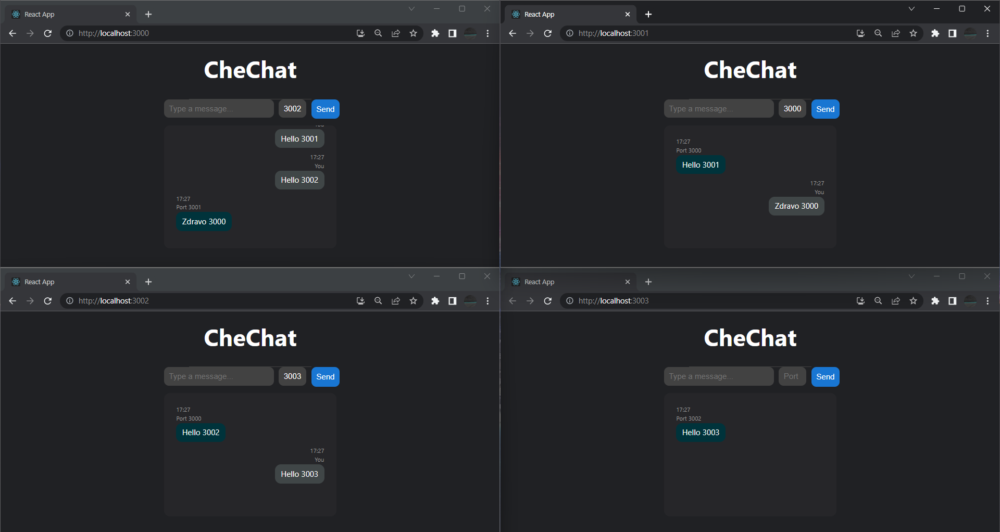

# CheChat

This is a chat app I built for practice and is free to use.

The backend of the app was made using GoLang and the frontend was built with ReactJS.

## Running the App

To run the app, you will need to:

1. Clone this repository to your local machine
2. Open two terminal windows and navigate to the root of the project in both
3. In one terminal window, navigate to the `/server` directory and run `go run main.go`
4. In the other terminal window, navigate to the `/client` directory and run `npm install` and then `npm start --port 3000`
5. In another terminal window, navigate to the `/client` directory again and run `npm start --port 3001`

The app should now be running on `http://localhost:3000` and `http://localhost:3001`.

## Usage

Once the app is running, you can open two different browser windows and navigate to the two different ports to simulate two users. You can then send messages back and forth between the two windows. Time will be displayed and you can nicely see which message is sent by who.

## Progress

